# Evenly

Shared expense tracking for roommates, trips, and teams. Record payments, split costs, and see who owes whom.

**[Open the live demo](https://evenly-client.onrender.com/)**

## Dashboard

Balances, open expenses, groups, and recent activity in one view.

[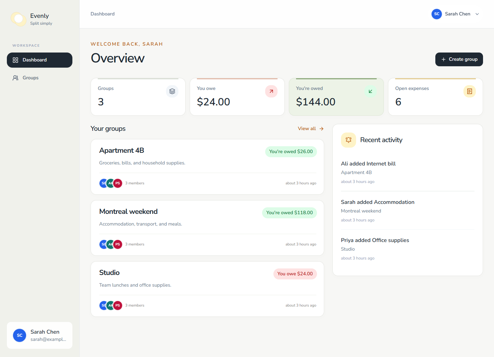](docs/screenshots/dashboard.png)

## Features

- **Groups:** create a group and add registered users by email.
- **Expenses:** record the payer, participants, amount, and notes; edit or delete entries.
- **Splits:** divide costs equally or assign custom amounts, with total validation.
- **Balances:** see each member’s share and suggested repayments.
- **Settlements:** mark an expense settled while retaining its history.
- **Live updates:** group expenses and balances refresh through Socket.IO.
- **Accounts:** sign up, sign in, and update your name or password.

Amounts display in USD. Settlement records the entire expense as settled; it does not transfer money or track partial repayments. Only a participant who owes on an expense can mark it settled.

## Screenshots

Sample data. Click any image to view it at full size.

<table>
  <tr>
    <td width="50%" align="center" valign="top"><strong>Dashboard</strong><br><br><a href="docs/screenshots/dashboard.png"></a></td>
    <td width="50%" align="center" valign="top"><strong>Your groups</strong><br><br><a href="docs/screenshots/groups.png">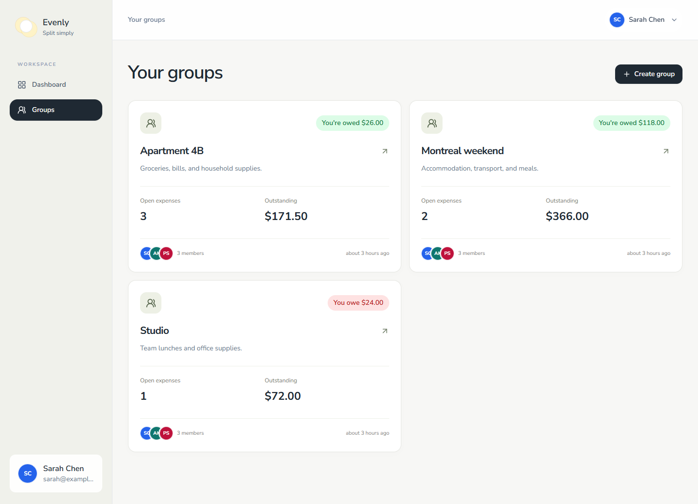</a></td>
  </tr>
  <tr>
    <td width="50%" align="center" valign="top"><strong>Sign in</strong><br><br><a href="docs/screenshots/sign-in.png">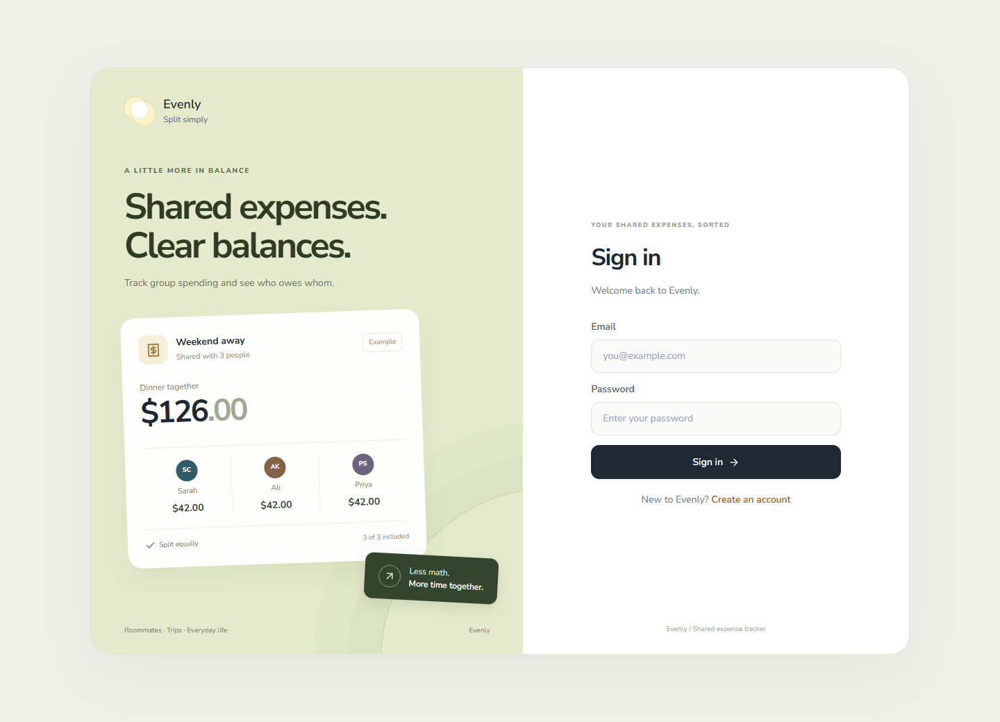</a></td>
    <td width="50%" align="center" valign="top"><strong>Create an account</strong><br><br><a href="docs/screenshots/sign-up.png">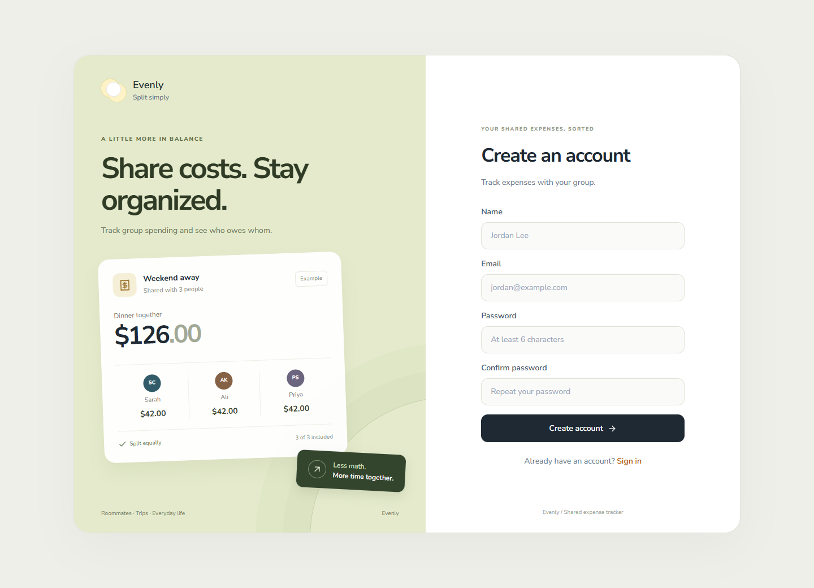</a></td>
  </tr>
  <tr>
    <td width="50%" align="center" valign="top"><strong>Create a group</strong><br><br><a href="docs/screenshots/create-group.png">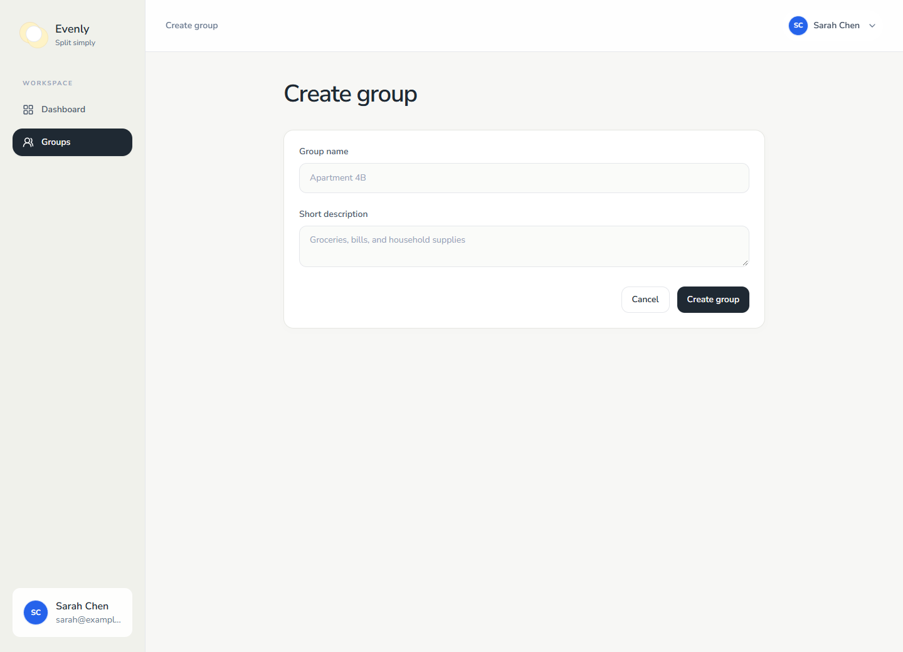</a></td>
    <td width="50%" align="center" valign="top"><strong>Manage members</strong><br><br><a href="docs/screenshots/members.png">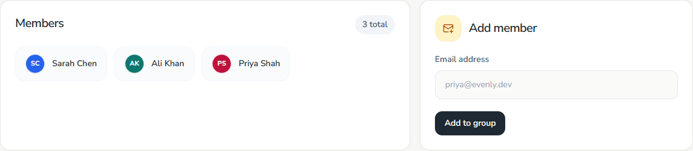</a></td>
  </tr>
  <tr>
    <td width="50%" align="center" valign="top"><strong>Equal split</strong><br><br><a href="docs/screenshots/equal-split.png">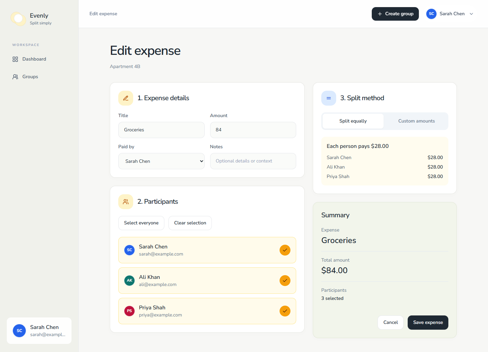</a></td>
    <td width="50%" align="center" valign="top"><strong>Custom amounts</strong><br><br><a href="docs/screenshots/custom-split.png">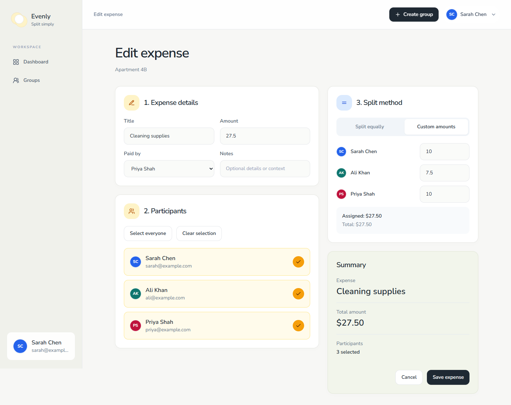</a></td>
  </tr>
  <tr>
    <td width="50%" align="center" valign="top"><strong>Group balances</strong><br><br><a href="docs/screenshots/balances.png">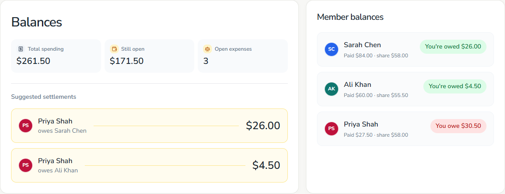</a></td>
    <td width="50%" align="center" valign="top"><strong>Expense history</strong><br><br><a href="docs/screenshots/expenses.png">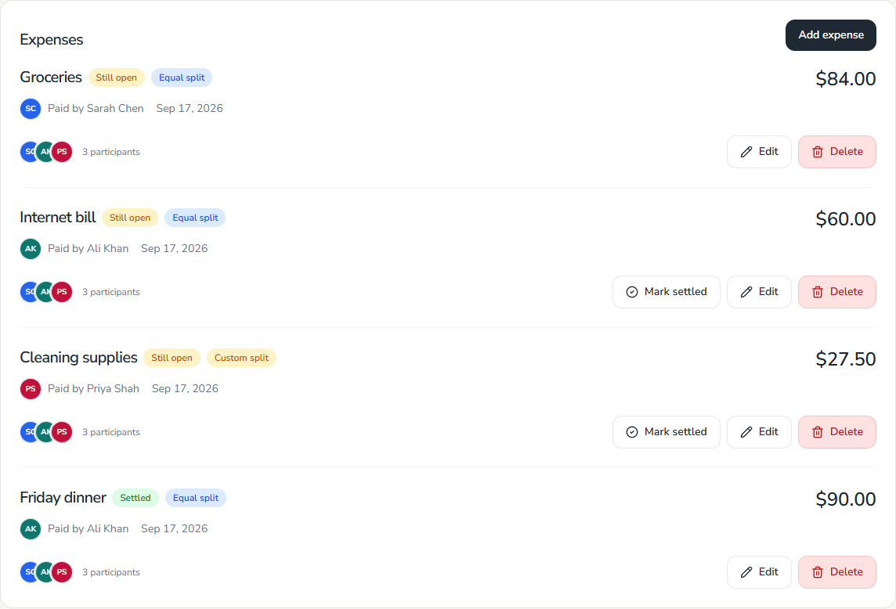</a></td>
  </tr>
  <tr>
    <td width="50%" align="center" valign="top"><strong>Settle an expense</strong><br><br><a href="docs/screenshots/settlement.png">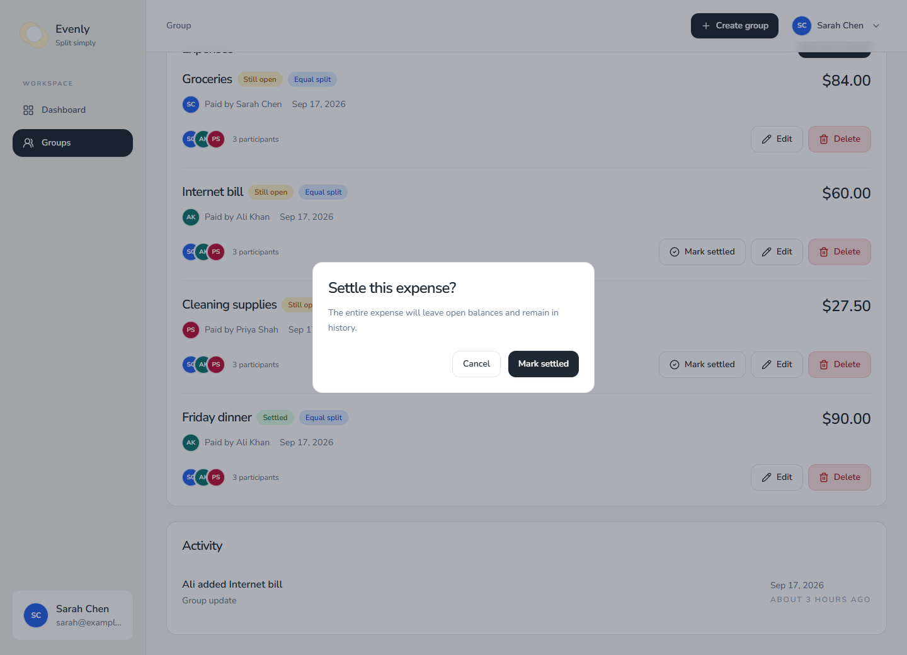</a></td>
    <td width="50%" align="center" valign="top"><strong>Group activity</strong><br><br><a href="docs/screenshots/activity.png">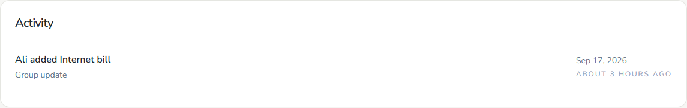</a></td>
  </tr>
  <tr>
    <td width="50%" align="center" valign="top"><strong>Account settings</strong><br><br><a href="docs/screenshots/profile.png">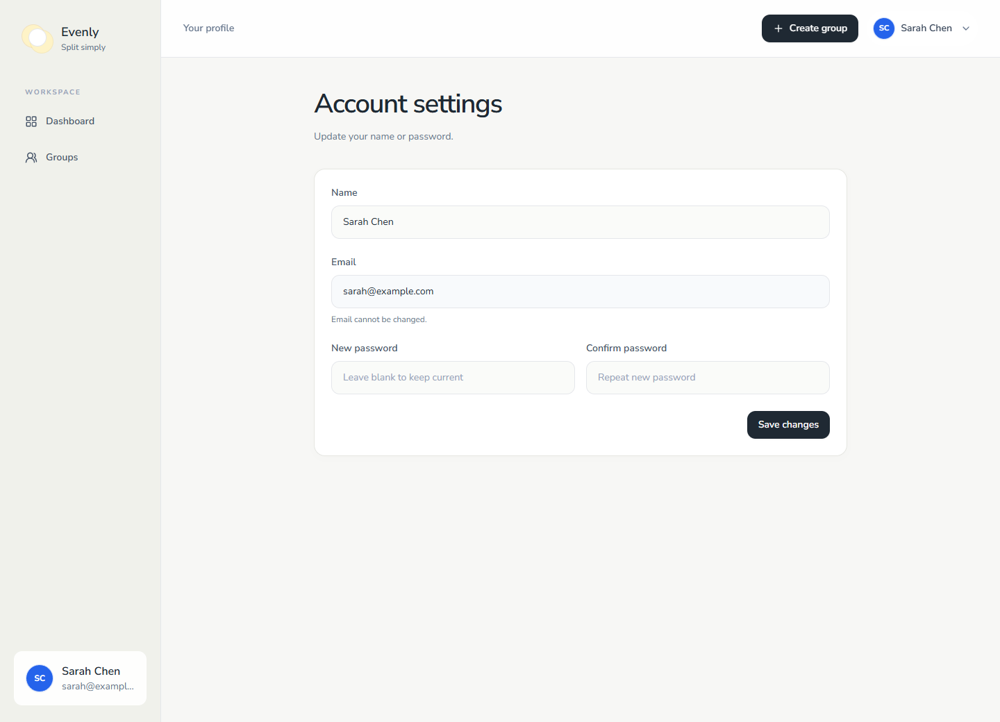</a></td>
    <td width="50%" align="center" valign="top"><strong>Mobile dashboard</strong><br><br><a href="docs/screenshots/mobile-dashboard.png">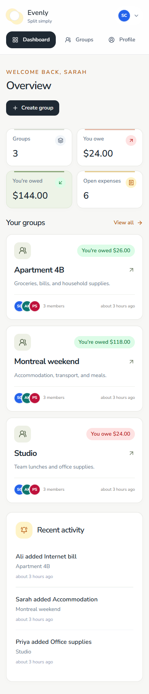</a></td>
  </tr>
  <tr>
    <td width="50%" align="center" valign="top"><strong>Mobile sign in</strong><br><br><a href="docs/screenshots/mobile-sign-in.png">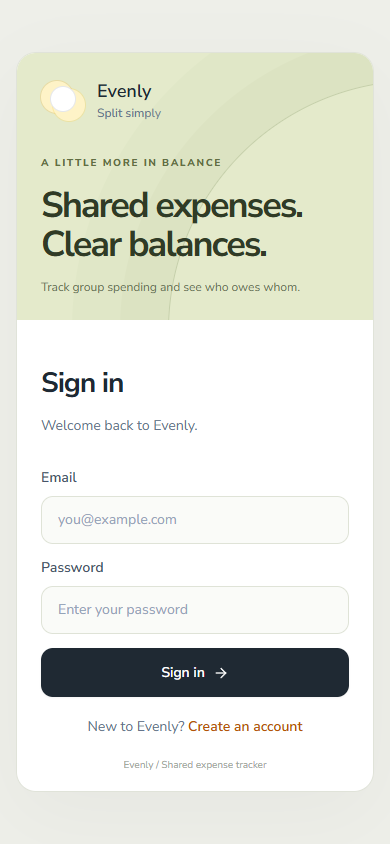</a></td>
    <td width="50%" align="center" valign="top"><strong>Mobile registration</strong><br><br><a href="docs/screenshots/mobile-sign-up.png">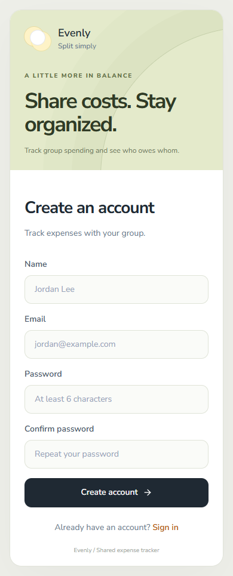</a></td>
  </tr>
</table>

## Tech stack

| Layer          | Tools                                   |
| -------------- | --------------------------------------- |
| Frontend       | React, Vite, React Router, Tailwind CSS |
| API            | Node.js, Express, Zod                   |
| Database       | MongoDB, Mongoose                       |
| Authentication | JWT, bcrypt                             |
| Real time      | Socket.IO                               |

## Local setup

Requires Node.js 22+ and a MongoDB instance (local or Atlas).

1. Install dependencies from the repository root:

   ```bash
   npm install
   npm run install:all
   ```

2. Copy `server/.env.example` to `server/.env` and `client/.env.example` to `client/.env`.

3. Set `MONGODB_URI` and a strong `JWT_SECRET` in `server/.env`.

4. Start the API and frontend in separate terminals:

   ```bash
   npm run dev:server
   ```

   ```bash
   npm run dev:client
   ```

Open [localhost:5173](http://localhost:5173). The API runs on port 5000 by default.

### MongoDB connection errors

`querySrv ENOTFOUND` means the Atlas hostname could not be resolved. Check that the cluster is active, then copy the connection string from **Atlas → Connect → Drivers** into `MONGODB_URI` in `server/.env`. Restart `npm run dev:server` after updating it. See [Atlas connection troubleshooting](https://www.mongodb.com/docs/atlas/troubleshoot-connection/).

For a running local MongoDB instance, use `MONGODB_URI=mongodb://127.0.0.1:27017/evenly` instead.

### Configuration

| File          | Variable          | Purpose / default                                |
| ------------- | ----------------- | ------------------------------------------------ |
| `server/.env` | `MONGODB_URI`     | MongoDB connection string; required              |
| `server/.env` | `JWT_SECRET`      | Token signing secret; required                   |
| `server/.env` | `JWT_EXPIRES_IN`  | Token lifetime; `7d`                             |
| `server/.env` | `PORT`            | API port; `5000`                                 |
| `server/.env` | `CLIENT_URL`      | Allowed frontend origin; `http://localhost:5173` |
| `server/.env` | `NODE_ENV`        | `development` or `production`                    |
| `client/.env` | `VITE_API_URL`    | API base URL; `http://localhost:5000/api`        |
| `client/.env` | `VITE_SOCKET_URL` | Socket server URL; `http://localhost:5000`       |

### Demo data

The seed script **deletes all users, groups, and expenses in the configured database** before inserting examples. Use a dedicated demo database.

```bash
npm run seed --prefix server
```

Sign in with `sarah@evenly.dev`, `ali@evenly.dev`, or `priya@evenly.dev`. The demo password is `password123`.

## Development

```bash
npm test                         # Split calculation tests
npm run build                    # Frontend production build
npm run preview --prefix client  # Preview the build
```

### Refresh screenshots

The capture script renders the real frontend using mocked API responses. It requires no database and checks key screens for runtime errors and mobile horizontal overflow.

```bash
npx playwright install chromium
npm run dev --prefix client -- --host 127.0.0.1 --port 5174
```

In a second terminal:

```bash
npm run screenshots
```

Set `SCREENSHOT_URL` to use another frontend address, or `SCREENSHOT_CHANNEL` to use an installed browser such as `msedge` or `chrome`.

### Project structure

```text
client/src/
  api/          API client
  components/   Shared UI
  contexts/     Authentication state
  hooks/        Socket connection
  layouts/      App navigation
  pages/        Application screens
server/src/
  controllers/  Request handlers
  middleware/   Authentication, validation, errors
  models/       MongoDB schemas
  routes/       API endpoints
  services/     Splits, balances, group access
  sockets/      Real-time events
  seed/         Demo data
scripts/        Screenshot capture
docs/screenshots/  README images
```

## API

All routes except signup and login require a bearer token. Group and expense routes enforce group membership.

| Method               | Endpoint                   | Action                         |
| -------------------- | -------------------------- | ------------------------------ |
| POST                 | `/api/auth/signup`         | Create account                 |
| POST                 | `/api/auth/login`          | Sign in                        |
| GET / PATCH          | `/api/auth/me`             | Read / update profile          |
| GET / POST           | `/api/groups`              | List / create groups           |
| GET / PATCH / DELETE | `/api/groups/:id`          | Read / update / delete group   |
| PATCH                | `/api/groups/:id/members`  | Update membership              |
| GET                  | `/api/groups/:id/balances` | Calculate balances             |
| GET / POST           | `/api/groups/:id/expenses` | List / create expenses         |
| GET / PATCH / DELETE | `/api/expenses/:id`        | Read / update / delete expense |
| PATCH                | `/api/expenses/:id/settle` | Settle expense                 |

Socket.IO uses authenticated group rooms. Expense changes emit `expense:updated` and `group:balancesUpdated`.

## Deployment

Run the API with `npm start --prefix server` and publish `client/dist` after `npm run build`. Set production API and socket URLs before building the frontend, configure `CLIENT_URL` to match its origin, and enable an SPA fallback to `index.html` on the frontend host. Keep database credentials and JWT secrets on the server.
